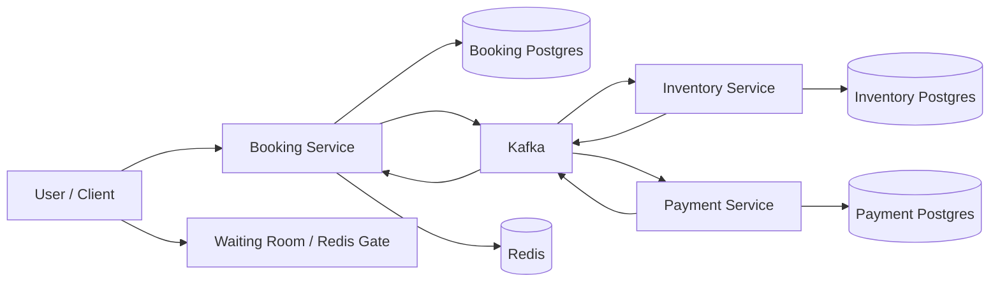
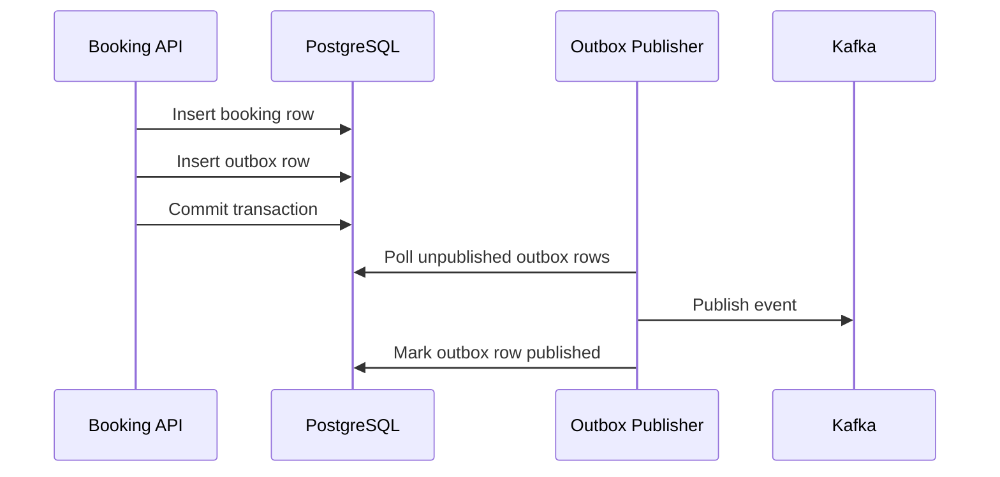
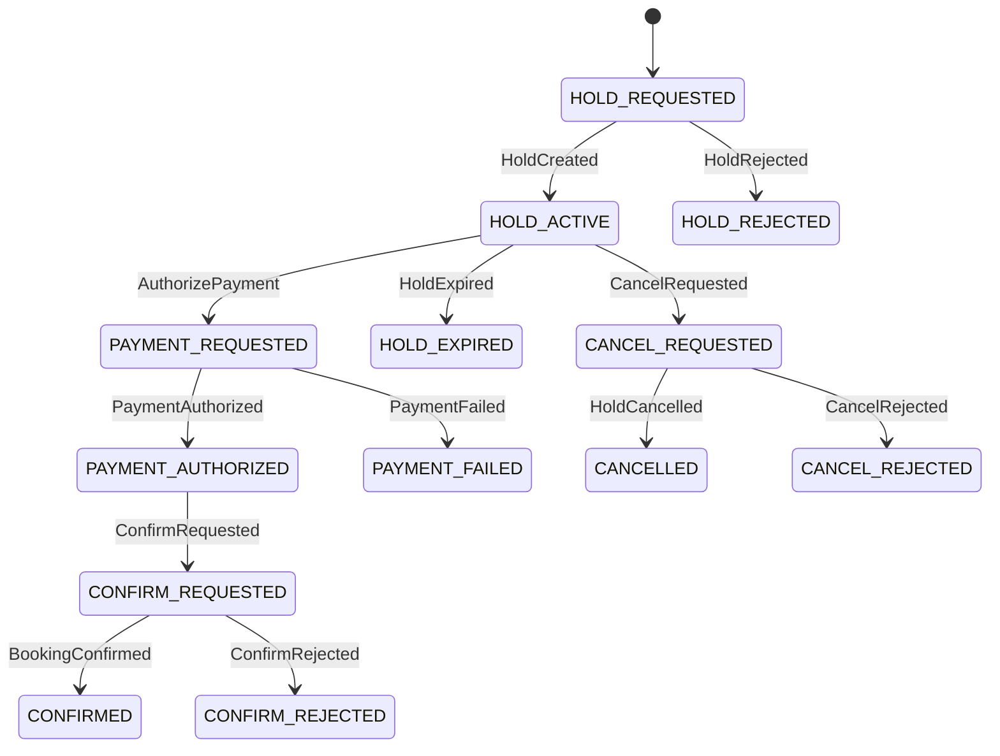
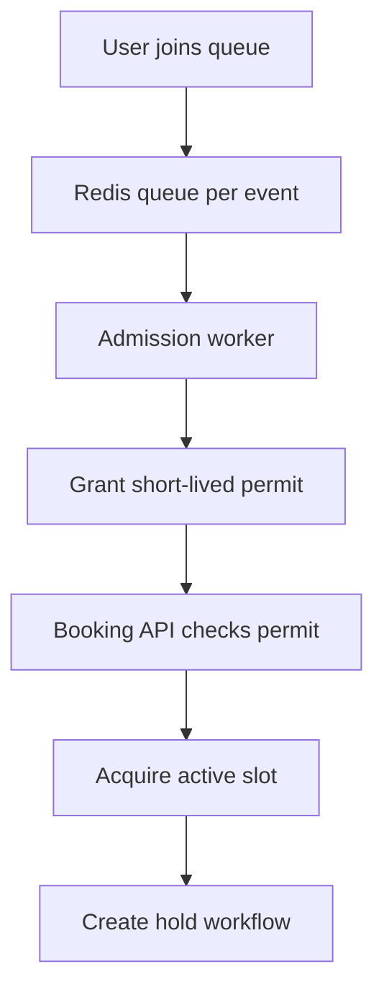
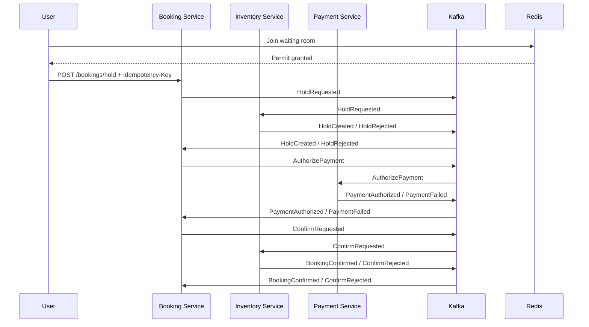

# Distributed Event-Driven Booking Platform

distributed systems project that models a commercial booking workflow under real-world failure conditions: duplicate requests, delayed callbacks, at-least-once delivery, hold expiry, overload, and compensation.

---

The project focuses on the distributed systems core:

- idempotent APIs and consumers
- transactional outbox pattern
- Kafka-based choreography
- hold / confirm / cancel saga flow
- fencing for confirm-after-expiry prevention
- Redis-based admission control and waiting room
- failure-oriented workflow design

---

## System overview

The platform is composed of multiple services with clear ownership boundaries:

- **Booking Service** — owns booking lifecycle and orchestrates workflow transitions
- **Inventory Service** — owns seat holds, expiry, cancellation, and final confirmation
- **Payment Service** — simulates payment authorization with duplicate and delayed callbacks
- **Kafka** — transports commands and events between services
- **PostgreSQL** — source of truth for each service’s state
- **Redis** — waiting room, permit tokens, and active-slot admission control

---

## High-level architecture




---

## Service responsibilities

### Booking Service

Owns the business-facing booking record and user-facing workflow state.

Responsibilities:

- create booking intents
- enforce API idempotency with `Idempotency-Key`
- write domain changes and outbox rows in one transaction
- consume inventory and payment events
- move booking through saga states
- enforce permit checks before entering hot-event workflow

### Inventory Service

Owns seat truth.

Responsibilities:

- allocate temporary holds
- expire holds and release seats automatically
- cancel holds as compensation
- confirm held seats atomically
- reject invalid or stale confirms
- publish hold and confirm outcome events

### Payment Service

Owns payment authorization simulation.

Responsibilities:

- consume payment authorization commands
- create idempotent payment records
- emit `PaymentAuthorized` or `PaymentFailed`
- simulate delayed and duplicate callbacks

---

## Core distributed systems features

### 1. Idempotent API commands

The Booking API accepts `Idempotency-Key` headers so retried client requests do not create duplicate bookings.

**Guarantee:**

- same `user_id + idempotency_key` → same booking result

This protects against:

- network timeouts
- browser refresh / resubmit
- mobile retries
- load balancer retries

---

### 2. Transactional Outbox

Each service uses the **transactional outbox pattern** to avoid the classic dual-write problem.

Instead of:

1. write DB row
2. publish Kafka event

which can fail in between,

the service does:

1. write domain state
2. write outbox row
3. commit
4. background publisher relays outbox rows to Kafka

**Guarantee:**

- if business state changed, the event is not lost

#### Outbox flow



---

### 3. Kafka-based saga choreography

The booking workflow is modeled as asynchronous state transitions across services.

#### Booking lifecycle



This is effectively a saga with compensating actions.

---

### 4. Inventory correctness under concurrency

Inventory is the authority for seat state transitions.

Seat state transitions:

- `AVAILABLE -> HELD`
- `HELD -> CONFIRMED`
- `HELD -> AVAILABLE` (expiry / cancel)

The service uses DB transactions, row locking, and state checks so that:

- no seat is confirmed twice
- confirm after expiry is rejected
- cancellation after confirm is rejected
- duplicate events do not corrupt state

---

### 5. Hold expiry

Held seats are not reserved forever.

A background worker scans expired holds and:

- marks hold as `EXPIRED`
- releases seats back to `AVAILABLE`
- emits `HoldExpired`

This prevents abandoned or failed workflows from permanently blocking inventory.

---

### 6. Confirm fencing

Confirmation is protected by a fence in Inventory.

A confirm succeeds only if:

- hold exists
- hold is still `ACTIVE`
- hold has not expired
- seats are still `HELD` for that hold

This prevents stale or late confirm attempts from finalizing invalid holds.

---

### 7. Compensation / cancel flow

If the workflow fails or the user cancels before final confirmation, Inventory releases seats and the saga is compensated.

This keeps the system from leaking reserved inventory after failures.

---

### 8. Redis admission control and waiting room

Popular events create hot keys and heavy contention. To protect the workflow, the system uses Redis to gate access.

Components:

- **active slot counter** per event
- **waiting queue** per event
- **short-lived permit tokens** for admitted users

Only users with a valid permit can enter the booking workflow.

#### Waiting room flow



This adds:

- backpressure
- fairness
- overload protection for hot events

---

## Event flow overview



---

## Data ownership model

Each service owns its own database.

- Booking DB owns booking workflow state
- Inventory DB owns hold and seat state
- Payment DB owns payment authorization state

This prevents cross-service table sharing and makes the event contracts explicit.

---

## Failure model covered

The project is intentionally designed around real failure modes:

- duplicate client requests
- duplicate Kafka deliveries
- delayed events
- late payment callbacks
- service crashes after DB commit
- service crashes before publish
- hold expiry races
- confirm-after-expiry attempts
- cancellation vs expiry races
- hot-event overload

---

## Key invariants

The system is designed around explicit correctness properties.

### Booking / Inventory invariants

- A seat cannot be confirmed twice.
- A hold cannot be confirmed after expiry.
- Cancel after confirmation is rejected.
- Duplicate API requests do not create duplicate bookings.
- Duplicate Kafka deliveries do not produce duplicate business effects.
- If business state changes, the corresponding event is eventually published.
- Active booking workflow concurrency per event is bounded.

---

## Tech stack

- **Java 21**
- **Spring Boot**
- **Spring Security + JWT**
- **Spring Data JPA**
- **PostgreSQL**
- **Flyway**
- **Kafka**
- **Redis**
- **Docker Compose**


## Local setup

### 1. Start infrastructure

```bash
docker compose up -d
```

### 2. Start services

Run each service locally:

- booking-service
- inventory-service
- payment-service

### 3. Create Kafka topics

```bash
docker exec -it booking-kafka kafka-topics --bootstrap-server localhost:9092 --create --topic booking.events --partitions 3 --replication-factor 1

docker exec -it booking-kafka kafka-topics --bootstrap-server localhost:9092 --create --topic inventory.events --partitions 3 --replication-factor 1

docker exec -it booking-kafka kafka-topics --bootstrap-server localhost:9092 --create --topic booking.commands --partitions 3 --replication-factor 1

docker exec -it booking-kafka kafka-topics --bootstrap-server localhost:9092 --create --topic payment.commands --partitions 3 --replication-factor 1

docker exec -it booking-kafka kafka-topics --bootstrap-server localhost:9092 --create --topic payment.events --partitions 3 --replication-factor 1
```

---

## Example workflow

### Register + login

Use Booking service auth endpoints to get a JWT.

### Join queue

```bash
POST /events/{eventId}/queue/join
```

### Check queue status

```bash
GET /events/{eventId}/queue/status
```

### Create hold

```bash
POST /bookings/hold
Authorization: Bearer <token>
Idempotency-Key: hold-123
```

### Confirm

```bash
POST /bookings/{bookingId}/confirm
Authorization: Bearer <token>
Idempotency-Key: confirm-123
```

### Cancel

```bash
POST /bookings/{bookingId}/cancel
Authorization: Bearer <token>
Idempotency-Key: cancel-123
```

## Planned / next improvements

- DLQ + retry backoff for Kafka consumers
- distributed tracing (OpenTelemetry)
- metrics dashboard (Prometheus / Grafana)
- chaos and invariant testing
- fair queue ordering across multiple events
- automatic cleanup / recovery tooling

